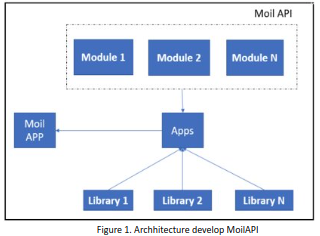
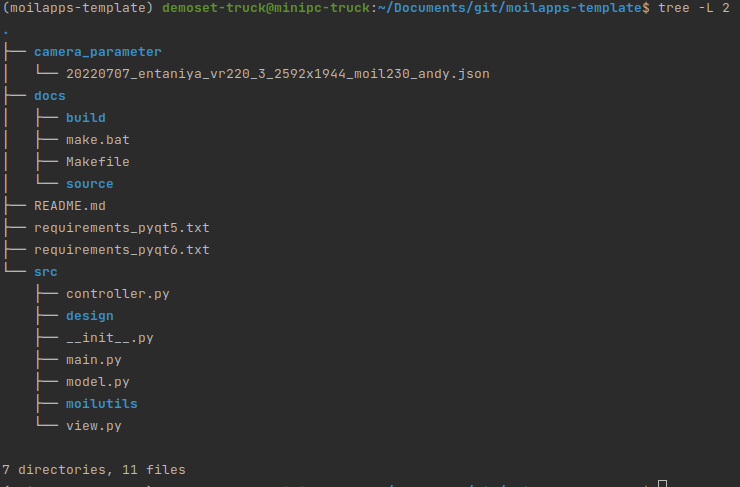

Definition and overview
#######################

What is Moil API?
=================

.. admonition:: Describe!

    API (Application Programming Interface) is a logical interface to a software component that hides the internal details needed to implement it. API also allows two applications can talk to each other. Some advantages of using API are increasing productivity, high efficiency, ease to understand, and reduced development time. The main reason for making this API is distributed development and modularized application. The main design for this API is shown in the image below:

From the picture above, in addition to speeding up development time and facilitating the application development process, the API also allows it to be a bridge in connecting the applications created with MOIL-APP.
Moil API is a collection of several modules that contain functions to simplify application development. The moil API we are developing is called MoilUtils. This API was developed with the aim of developing user interface-based applications using PyQt and the python programming language.

How to use Moil API in your independent Application?
====================================================
.. admonition:: Describe!

    Besides being used for making MoilApp application plugins, this API can also be used to develop applications independently. The source code can download on the following "git clone https://github.com/MoilOrg/moilapps-template.git"

After you download the source code of API, you can move the file to your working directory, don't forget you have to install it and activate the virtual environment according to the requirements. the file structure will look like the image below:

The Moil API currently has several main modules, namely Moilutils.

What is MoilUtils?
==================
.. admonition:: Describe!

    MoilUtils is a module that contains basic functions to build an application, there are approximately 20 functions that you can use to make it easier for you to develop applications. The first thing you have to do is import this module, you can see the example below:

>> from moilutils import MoilUtils

.. list-table:: The set of functions can be seen in the following table:
   :widths: 25 25 50
   :header-rows: 1

   * - Function
     -
     -
   * - select_type_camera()
     - remap_image()
     - draw_polygon()
   * - select_source_camera()
     - select_file()
     - write_camera_type()
   * - form_camera_parameter()
     - select_directory()
     - read_camera_type()
   * - show_image_to_label()
     - copyDirectory()
     - draw_point()
   * - connect_to_moildev()
     - resize_image()
     - saveImage()
   * - check_usb_camera_available()
     - rotate_image()
     - drawLine()
   * - read_image()
     - calculate_height()
     - calculate_ratio_image2label()

Application example
===================
.. admonition:: Describe!

    MoilUtils provides several functions that can be used for implementation in the current Omnidirectional Imaging Laboratory application development, as below:

1. select_type_camera()

Each image and video have different parameters depending on the camera used. This function allows a user to choose what parameter will be used. this function will open a dialog and you can select the parameter available from Combobox. for example:

>> type_camera = mutils.select_type_camera()

The dialog will be shown like the picture below. Just select oke after you choose the name of the parameter.

.. image:: assets/16.png
   :scale: 120 %
   :alt: alternate text
   :align: center

2. select_source_camera()

Open dialog to select the camera source. the available source camera from this dialog is a USB camera and a streaming camera. To get the camera source from this dialog, you can use the command line shown below:

>> cameraSource = mutils.select_source_camera()

.. image:: assets/14.png
   :scale: 120 %
   :alt: alternate text
   :align: center

3. form_camera_parameter()

Open camera parameters from to view detailed parameters of each camera. you just need to use it very easily by calling the function like the example below:

>> params = mutils.form_camera_parameter()

The result of this function is shown like picture bellow this:

.. image:: assets/15.png
   :scale: 140 %
   :alt: alternate text
   :align: center