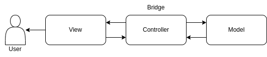

API Reference
#############

MVC module
===========
Model–view–controller (MVC) is a software architectural pattern[1] commonly used for developing user interfaces that
divide the related program logic into three interconnected elements. This is done to separate internal representations
of information from the ways information is presented to and accepted by the user.

|

.. automodule:: models.model
   :members:
   :undoc-members:
   :show-inheritance:

.. automodule:: views.view
   :members:
   :undoc-members:
   :show-inheritance:

.. automodule:: controllers.controller
   :members:
   :undoc-members:
   :show-inheritance:

