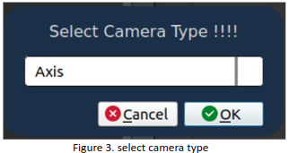
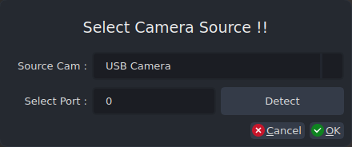
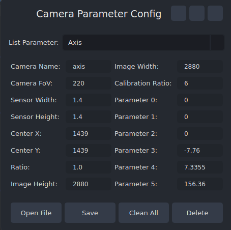
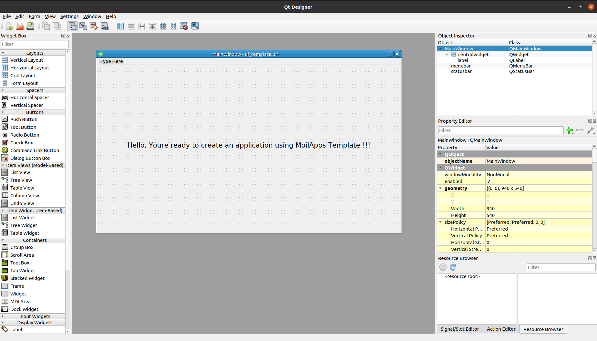
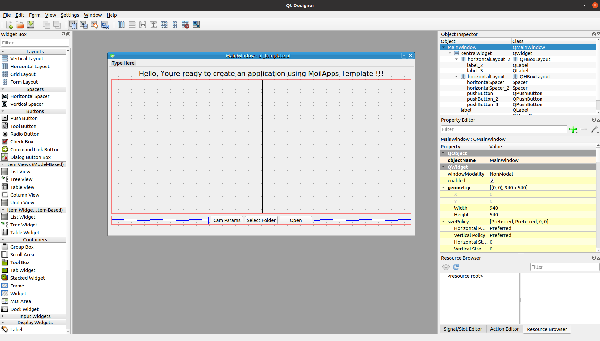
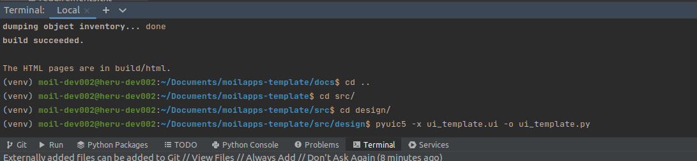
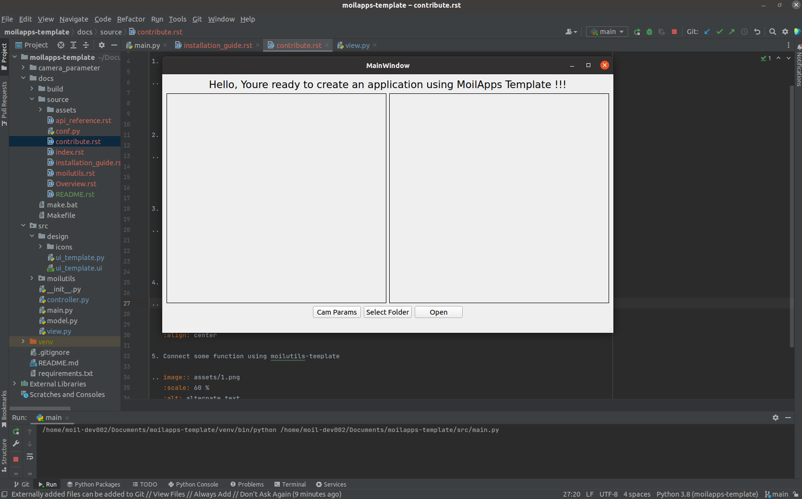
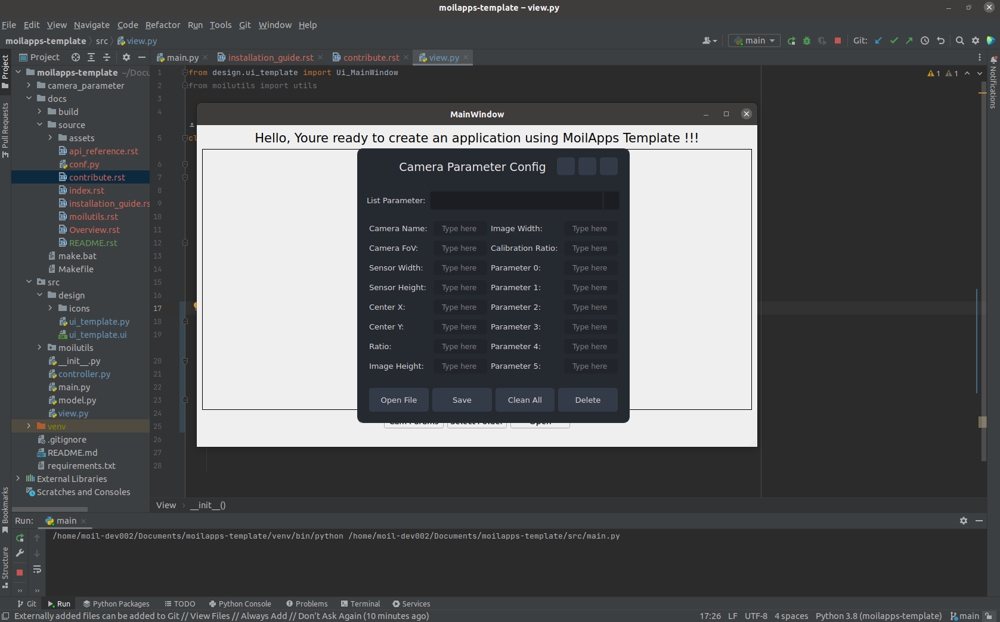
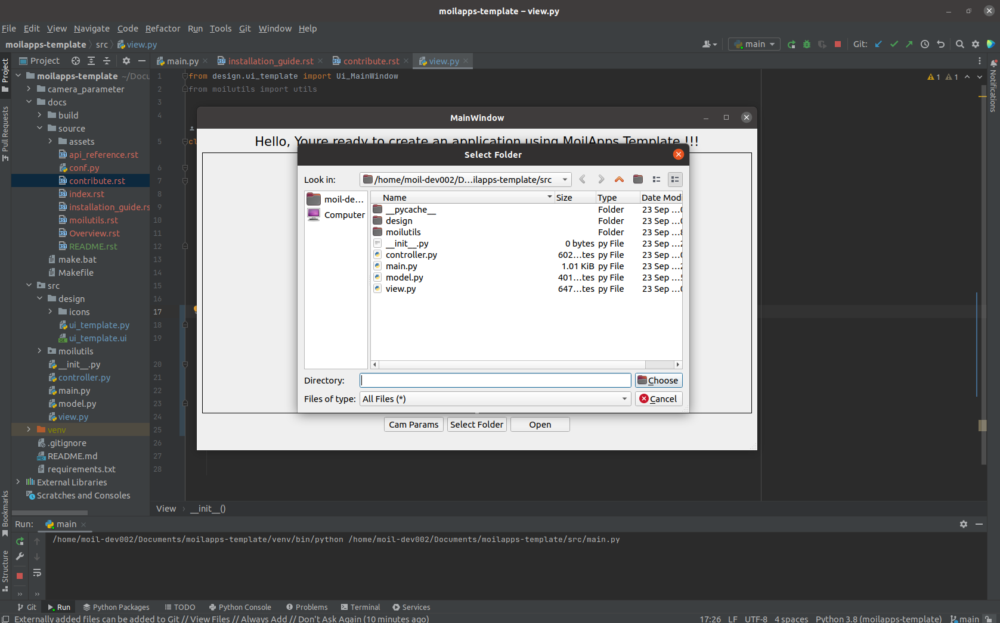

Tutorial
#################
.. warning::
    Follow these steps carefully so you can understand how to contribute using moilUtils.

Use Function Provided
=====================

>> from moilutils import mutils

.. list-table:: The set of functions can be seen in the following table:
   :widths: 25 25 50
   :header-rows: 1

   * - Function
     - Example
     - Note
   * - select_type_camera()
     - type_camera = mutils.select_type_camera()
     - Ready
   * - select_source_camera()
     - source_camera = mutils.select_source_camera()
     - Ready
   * - form_camera_parameter()
     - source_camera = mutils.form_camera_parameter()
     - Ready
   * - show_image_to_label()
     - mutils.show_image_to_label(self.label, src, 800)
     - Ready
   * - connect_to_moildev()
     - moildev = mutils.connect_to_moildev(type_camera= camera_type)
     - Ready
   * - check_usb_camera_available()
     - usb_camera = mutils.check_usb_camera_available()
     - Ready
   * - read_image()
     - src = mutils.read_image("../docs/source/assets/colon_phantom.png")
     - Ready
   * - remap_image()
     - anypoint = mutils.remap_image(image, mapx, mapy)
     - Ready
   * - draw_polygon()
     - image = mutils.draw_polygon(image, mapX, mapY)
     - Ready
   * - select_file()
     - image = mutils.select_file("Select file", "./docs/source/assets/colon_phantom.png")
     - Ready
   * - select_directory()
     - image = mutils.select_directory(None, "Select directory")
     - Ready
   * - copyDirectory()
     - mutils.copy_directory(src, dst)
     - Ready
   * - resize_image()
     - image = mutils.resize_image(src, 400)
     - Ready
   * - rotate_image()
     - rotate_image = mutils.rotate_image(image, 90)
     - Ready
   * - calculate_height()
     - image_h = mutils.calculate_height(src, 400)
     - Ready
   * - write_camera_type()
     - image = mutils.write_camera_type("../docs/source/assets/colon_phantom.png", "raspi")
     - Ready
   * - read_camera_type()
     - camera_type = mutils.read_camera_type("../docs/source/assets/colon_phantom.png")
     - Ready
   * - draw_point()
     - image = mutils.draw_point(image1, (100, 100), 5)
     - Ready
   * - saveImage()
     - image = mutils.save_image(image, "../docs/source/assets/colon_phantom.png")
     - Ready
   * - drawLine()
     - draw_line = mutils.draw_line(image1, (200, 200))
     - Ready
   * - calculate_ratio_image2label()
     - ratio_x, ratio_y = mutils.calculate_ratio_image2label(label, image)
     - Ready

.. admonition:: Important!

    MoilUtils provides several functions that can be used for implementation in the current Omnidirectional Imaging Laboratory application development, as below:

1. select_type_camera()

Each image and video have different parameters depending on the camera used. This function allows a user to choose what parameter will be used. this function will open a dialog and you can select the parameter available from Combobox. for example:

>> type_camera = mutils.select_type_camera()

The dialog will be shown like the picture below. Just select oke after you choose the name of the parameter.

|

2. select_source_camera()

Open dialog to select the camera source. the available source camera from this dialog is a USB camera and a streaming camera. To get the camera source from this dialog, you can use the command line shown below:

>> cameraSource = mutils.select_source_camera()

|

3. form_camera_parameter()

Open camera parameters from to view detailed parameters of each camera. you just need to use it very easily by calling the function like the example below:

>> params = mutils.form_camera_parameter()

The result of this function is shown like picture bellow this:

|

Design User Interface
=====================

1. Open the user interface

|

2. Editing the user interface like you want

|

3. Save the user interface

|

4. Running the program

|

5. Connect some function like showing camera parameter using moilutils-template

|

5. Connect some function like showing select directory in computer using moilutils-template

