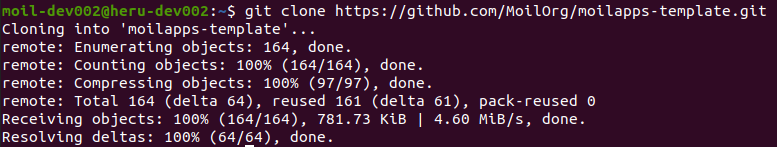
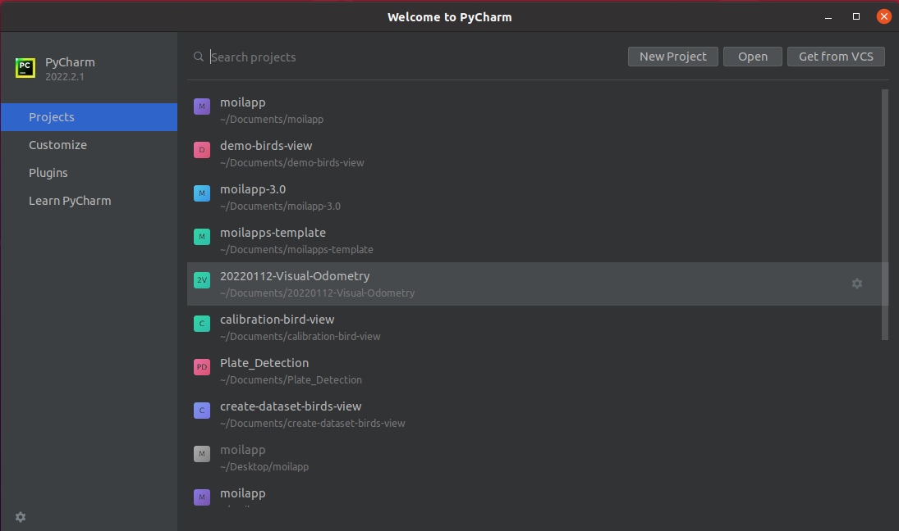
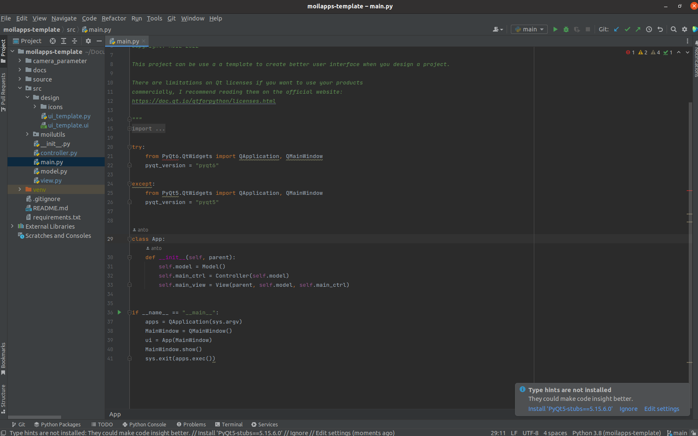
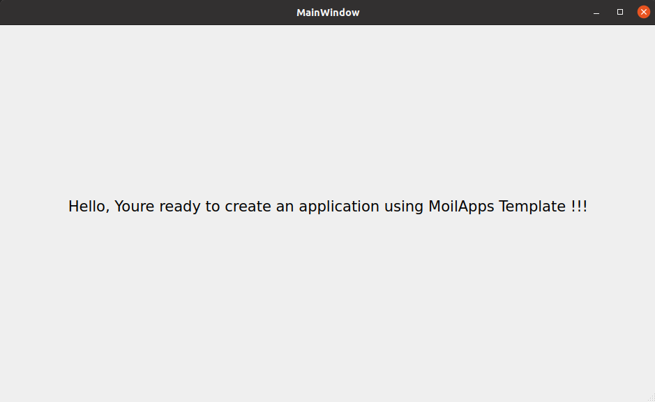

Installation Guide
##################

.. warning::
    Attention, the following steps to help you how to clone from github to run moilUtils template.

1.  Clone MoilUtils-Template
    "git clone https://github.com/MoilOrg/moilapps-template.git"

2. Change directory
    "cd moilapps-template"

3. Open pycharm

4. Showing the program

4. Running Program

